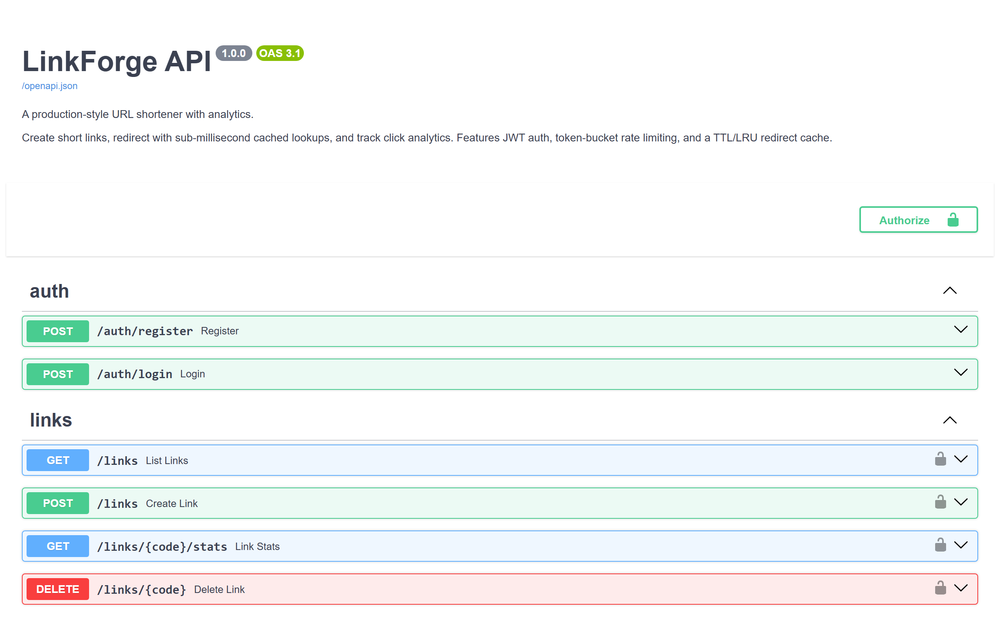
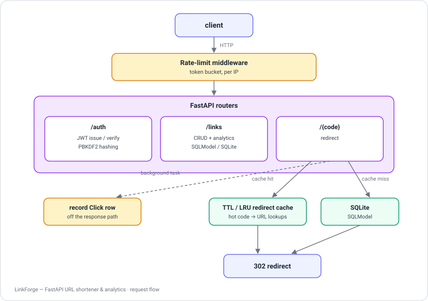

<!-- ══════════════════════════ PORTADA ══════════════════════════ -->
<div align="center">
  
</div>

<br/>

<!-- ══════════════════════ IDIOMAS / LANGUAGES ══════════════════════ -->
<div align="center">
<a href="README.md"></a>
<a href="README.en.md"></a>
<a href="README.es.md"></a>
</div>

<br/>

<div align="center">
<a href="https://github.com/geoggrigori/linkforge-api/actions/workflows/ci.yml"></a>
<br/>


</div>

<div align="center">
<a href="#acerca-de"></a>
<a href="#api"></a>
<a href="#arquitectura"></a>
<a href="#tecnologías"></a>
<a href="#uso"></a>
</div>

<br/>

> 💡 **No esconde los algoritmos.** El rate limiter (token bucket) y el caché (TTL/LRU) están hechos a mano para mostrar la ingeniería detrás, no escondida tras una librería.

<div align="center">
  
</div>

## Acerca de

**LinkForge** es un **acortador de URL & API de analytics de nivel producción**, construido con FastAPI. No es un CRUD de juguete — está diseñado para mostrar la ingeniería que separa un endpoint de hobby de un servicio real: autenticación, rate limiting, caché, procesamiento en background, pruebas, containerización y CI.

**Destacados:**
- **JWT** — registro/login, contraseñas con PBKDF2-HMAC-SHA256 (salt por usuario, verificación en tiempo constante). Nunca texto plano.
- **Rate limiting (token bucket)** — middleware ASGI propio, por IP, con `Retry-After`. Sin necesitar Redis para una sola instancia.
- **Caché TTL + LRU** — lookups calientes `code → URL` se saltan la base de datos; thread-safe, acotado, con expiración automática.
- **Analytics asíncrono** — los clics se registran en una tarea de background, fuera del camino de la respuesta.
- **Ownership** — cada usuario solo ve y gestiona sus propios links.
- **Docs OpenAPI automáticas** — Swagger UI interactivo en `/docs`, ReDoc en `/redoc`.
- **Totalmente probado** — 16 pruebas pytest cubriendo auth, validación, redirects, analytics y autorización.
- **Containerizado + CI** — Dockerfile (non-root, healthcheck), `docker-compose`, GitHub Actions corriendo la suite en cada push.

## API

| Método | Endpoint | Auth | Descripción |
|---|---|:---:|---|
| `POST` | `/auth/register` | — | Crea una cuenta |
| `POST` | `/auth/login` | — | Devuelve un token JWT |
| `POST` | `/links` | ✅ | Crea un link corto (código aleatorio o personalizado) |
| `GET` | `/links` | ✅ | Lista tus links con conteo de clics |
| `GET` | `/links/{code}/stats` | ✅ | Analytics de un link |
| `DELETE` | `/links/{code}` | ✅ | Elimina un link |
| `GET` | `/{code}` | — | Redirige a la URL destino (302) + registra el clic |
| `GET` | `/health` | — | Liveness probe |

Docs completas e interactivas en **`/docs`** con la app corriendo.

## Arquitectura

<div align="center">
  
</div>

## Tecnologías

| Capa | Tecnología |
|---|---|
| Framework | FastAPI (+ middleware Starlette) |
| Datos | SQLModel / SQLAlchemy, SQLite (listo para Postgres vía `DATABASE_URL`) |
| Auth | PyJWT + PBKDF2 de la stdlib |
| Pruebas | pytest + httpx (`TestClient`) |
| Ops | Docker, docker-compose, GitHub Actions |

## Uso

**Local:**
```bash
python -m venv .venv
source .venv/bin/activate          # Windows: .venv\Scripts\activate
pip install -r requirements.txt

cp .env.example .env   # opcional

uvicorn app.main:app --reload
```
Abre **http://localhost:8000/docs** y pruébalo.

**Docker:**
```bash
docker compose up --build
```

**Pruebas:**
```bash
pytest -q
```
La suite levanta la app contra un SQLite descartable y ejercita el ciclo completo (auth → creación → redirect → analytics → autorización).

## Licencia

[MIT](LICENSE).

<div align="center">
  
</div>

<p align="center"><sub>Desarrollado por <strong><a href="https://github.com/geoggrigori">Grigori</a></strong> · 2026</sub></p>
